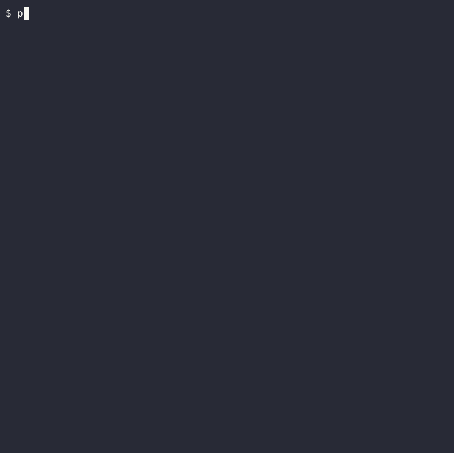

# small-python-projects

\
Non-chronological practice from `The Big Book of Small Python Projects`
by Al Sweigart.
\
\
The contents of this book can be found (at the time of writing),
here: <https://inventwithpython.com/bigbookpython/>
\
\
The goal of going through these mini-projects is to encounter
\
interesting techniques and data structures for solving simple problems
\
with Python.

## Notes on individual projects

## 1.Bagels

Was reminded that `main()` is just a function that can be called within itself, à la recursion.

## 35.Hex Grid

Learned that a tesselation requires minimal starting shapes.
\
Became familiar with python's `argparse` module for handling commandline arguments.
\
\

## 3.Bitmap Message

Re-learned the magical utility of the modulo operator, for repeating sequence of things.
\
\
I created a separate .py file to store the bitmap pattern, rather than store the pattern
\
inside the same py file as the general script.
\
\

## 12.Collatz Sequence

Un-learned the now-automatic practice of first accumulating a string using a a list,
\
then using .join() to make the string.You can instead print characters as you need them.
\
\
Learned what "flushing" output,to prevent it from being buffered, is.
\
Experimented with the `rich` library for text formatting
\
\

## 12.DNA Visualization

Learned that the `{}` delimeter of the `str.format()` method can be pre-defined
\
in the string, then formatted later.
\
\
Added more DNA variants, including a representation of DNA inspired by the film
Blade Runner 2049.
\
\
Used classes to enable those other DNA variants
\
\

## 11.Clickbait Headline Generator

Learned how to achieve the effects of a chain of if-elif-elif.. condtions with a
dictionary-based approach.
\
Changed the nouns, places, and states so that they live in files, as opposed to
inside the python script itself.
\
Used a considerably larger word list overall.
\
\

## 57.Progress Bar

Learned about the '\b' escape character for back-spacing.
\
\
Used more functions to split the load of the original getProgressBar function.
\
\
Addded the ability to specify how much 'data' to 'download'.
\
\
Added a display mode where the 'downloaded data' is displayed as stacked chunks,
that look like a ladder.
\
\

 

  
