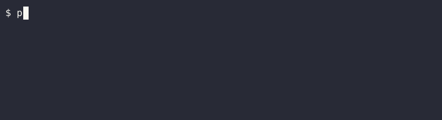
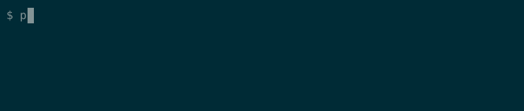
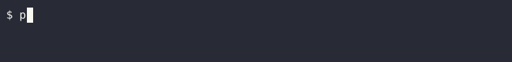

# small-python-projects
Non-chronological practice from `The Big Book of Small Python Projects` 
by Al Sweigart.
 
 
The contents of this book can be found (at the time of writing), 
here: <https://inventwithpython.com/bigbookpython/>
 
 
The goal of going through these mini-projects is to encounter 
interesting techniques and data structures for solving simple problems 
with Python.
 

## Notes on individual projects
 

## 1.Bagels
Was reminded that `main()` is just a function that can be called within itself, à la recursion.
  

## 35.Hex Grid
Learned that a tesselation requires minimal starting shapes.
  

## 3.Bitmap Message
Re-learned the magical utility of the modulo operator, for repeating sequences 
of things.

I created a separate .py file to store the bitmap pattern, rather than store the  
pattern inside the same py file as the general script.
  

## 12.Collatz Sequence
Un-learned the now-automatic practice of first accumulating a string using a a list, 
then using .join() to make the string.You can instead print characters as you need them.

Learned what "flushing" output,to prevent it from being buffered, is.
  

## 12.DNA Visualization
Learned that the `{}` delimeter of the `str.format()` method can be pre-defined 
in the string, then formatted later.

Added more DNA variants, including a representation of DNA inspired by the film
Blade Runner 2049.

Used classes to enable those other DNA variants
 

  

## 11.Clickbait Headline Generator
Learned how to achieve the effects of a chain of if-elif-elif.. condtions with a
dictionary-based approach.

Changed the nouns, places, and states so that they live in files, as opposed to
inside the python script itself.

Used a considerably larger word list overall.
 

  

## 57.Progress Bar
Learned about the '\b' escape character for back-spacing.

Used more functions to split the load of the original getProgressBar function.
 

  
